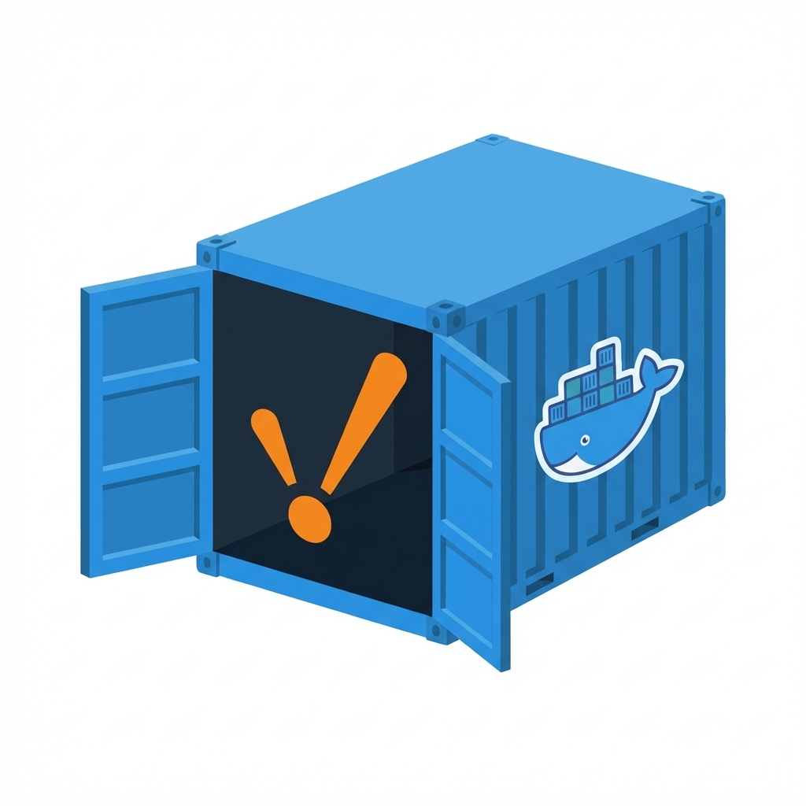
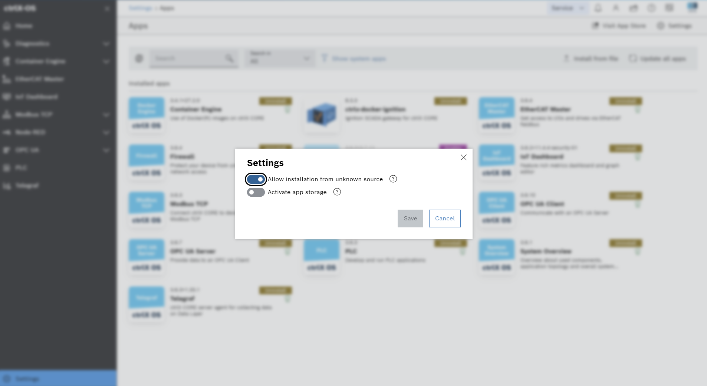
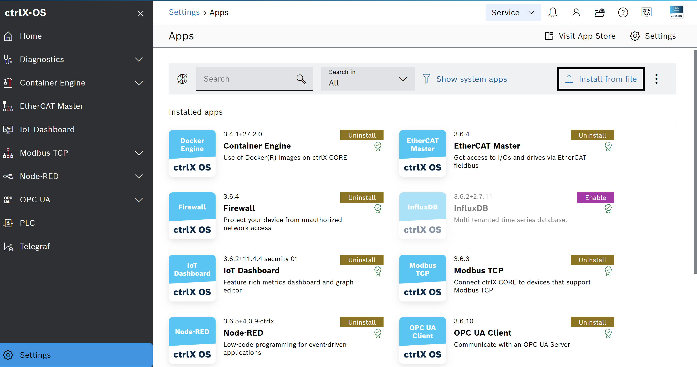
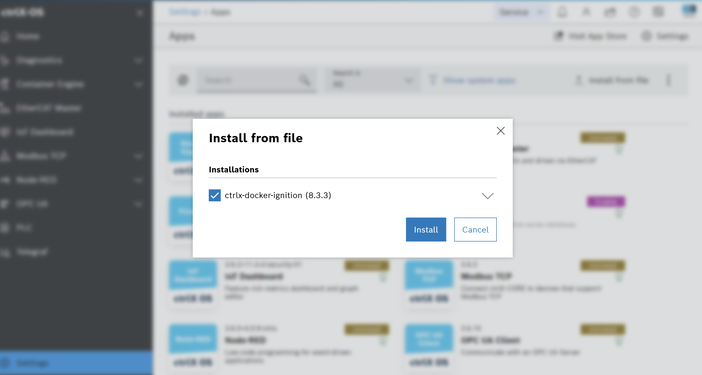
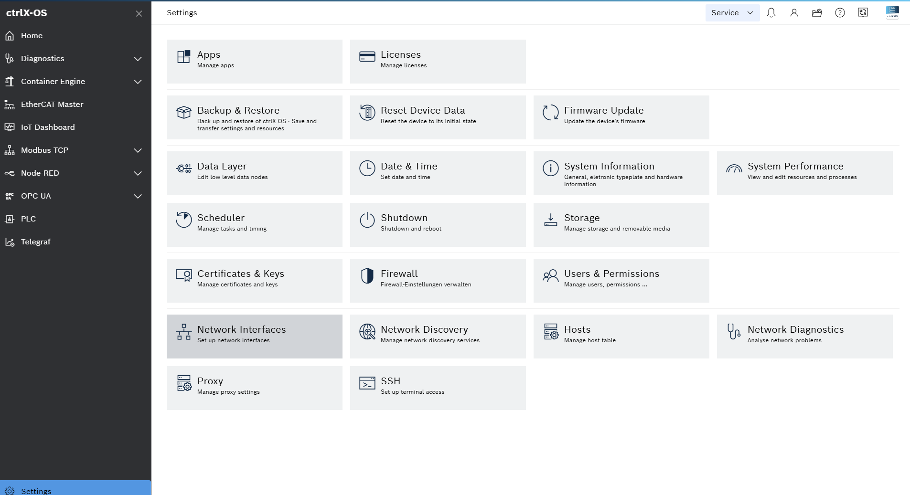
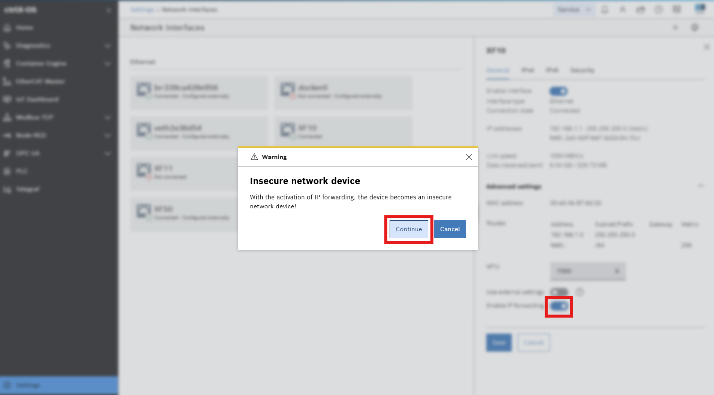

<p align="center">
  
</p>

# ctrlx-docker-ignition

A snap package that bundles [Ignition SCADA](https://inductiveautomation.com/ignition/) (by Inductive Automation) as a Docker image for deployment on **Bosch Rexroth ctrlX OS** via the Container Engine app.

No internet access required on the device — the Docker image is embedded in the snap.

## Prerequisites

| Tool         | Purpose                                     |
| ------------ | ------------------------------------------- |
| `docker`     | Pull and export the Ignition image          |
| `snapcraft`  | Build the snap package                      |
| `curl`, `jq` | Resolve image versions from Docker Registry |

On the ctrlX device:

- **Container Engine** app installed
- **IP port forwarding** enabled on the network interface (see [Deployment](#deployment))

## Configuration

Copy `.envrc.example` to `.envrc` and fill in your values:

```bash
cp .envrc.example .envrc
```

```bash
TARGET_ARCH="amd64"        # amd64 = X5/X7 | arm64 = X3
IMAGE_NAME="inductiveautomation/ignition"
IMAGE_TAG="latest"
GATEWAY_ADMIN_USERNAME="admin"
GATEWAY_ADMIN_PASSWORD="changeme"
IGNITION_EDITION="edge"    # edge | standard | maker
ACCEPT_IGNITION_EULA="Y"
```

## Build

### Full build (image + snap)

```bash
./scripts/build_all.sh
```

### Step by step

```bash
# 1. Pull the Docker image and stage it for the snap
./scripts/build_image.sh

# 2. Build the snap package
./scripts/build_snap.sh
```

The snap is output to `build/dist/`.

### Cache

The Docker image is cached in `cache/` to avoid re-pulling on subsequent builds. To clear it:

```bash
./scripts/clean_cache.sh
```

## Deployment

### 1. Sideload the snap on ctrlX OS

In the ctrlX OS web UI:

1. Go to **Settings → Apps**
2. Click **Setup** (top right) → enable **Allow installation from unknown source** → **Save**

   

3. Select the `.snap` from `build/dist/`

   

4. Click **Install from file**

   

### 2. Enable IP port forwarding

By default, ctrlX OS does not enable IP forwarding — Docker cannot expose ports externally without it.

1. Go to **Settings → Network → Network Interfaces**

   

2. Select your network interface → **IPv4** tab
3. Enable **IP port forwarding** → **Save**
4. A security warning will appear — confirm with **Continue**

   

> ⚠️ For production environments, consider using a reverse proxy or VPN instead of enabling IP forwarding globally.

### 3. Access Ignition

Once the snap is installed and IP forwarding is enabled:

| Protocol | URL                        |
| -------- | -------------------------- |
| HTTP     | `http://<device-ip>:9088`  |
| HTTPS    | `https://<device-ip>:9043` |

## Ports

| Host port | Container port | Purpose                                 |
| --------- | -------------- | --------------------------------------- |
| `9088`    | `8088`         | Ignition HTTP gateway                   |
| `9043`    | `8043`         | Ignition HTTPS gateway                  |
| `8060`    | `8060`         | Ignition Gateway Network (edge↔central) |

## Gateway Network (Edge ↔ Central)

To connect this Ignition Edge instance to a central Ignition gateway:

**On the central Ignition:**

1. Go to `Config → Gateway Network → General`
2. Set **Gateway Address** to the real IP of the machine running central Ignition (not `localhost` or a Docker internal IP)
3. Go to `Config → Gateway Network → Outgoing Connections` → **Create new connection**
4. Set **Host** to the ctrlX device IP (e.g. `192.168.1.1`) — no protocol prefix
5. Set **Port** to `8060`

## Project structure

```
.
├── docker/
│   └── docker-compose.yml       # Service definition
├── assets/                      # Screenshots for README
├── scripts/
│   ├── build_all.sh             # Full build (image + snap)
│   ├── build_image.sh           # Pull, cache, and stage Docker image
│   ├── build_snap.sh            # Build snap package
│   ├── clean_cache.sh           # Clear image cache
│   └── lib/log.sh               # Logging helpers
├── snapcraft/
│   ├── snapcraft.yaml           # Snap definition
│   └── gui/
│       └── icon.png             # Snap store icon
└── .envrc.example               # Configuration template
```

## License

This project is not affiliated with Inductive Automation or Bosch Rexroth.
Ignition is a trademark of [Inductive Automation](https://inductiveautomation.com/).
ctrlX is a trademark of [Bosch Rexroth](https://www.boschrexroth.com/).
